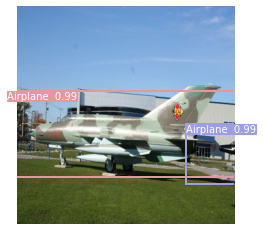

# Design YOLOV4 Model, Train & Prediction

Model & Training Code: [YOLOv4.ipynb](./YOLOv4.ipynb) <br/>
Trained first 20 epoch only for classification & then continue training model for full-fledged object detection 

Implemented YoloV4 Architecture as shown below (For Input Image 320x320 )


Training Loss vs Epoch Graph: <br/>


<br/>

## <ins> YOLOV4 Loss Function </ins>


In YOLOV4, **CIOU Loss** used as boundingbox coordinate regression loss function

CIOU considering below 3 factors. its converge faster & give higher accuracy than normal MSE loss

1. Overlapping Area
2. Distance from centre points
3. Aspect ratio


## <ins> YOLOV4 Features </ins>

### 1. Modified SPP (spatial pyramid pooling layer)

SPP Layer used for increasing receptive field


### 2. Modified FPN + PAN (Feature Pyramid Netowrk + Path Aggregation block)

FPN is joins top-down bypass/later connection which high sematics information to features particulrly low-level feature which veryful for classification <br/>
Low-level feature is very useful for positioning/bbox/spatial information, PAN trying to use this information <br/>

In FPN also, P5 indirectly integrating low-level feature(P5-P2). but information flow very is too long (red dot line)<br/>
Using PAN, Lowest feature flow through very few layers(green dot line)<br/>

FPN+PAN accelerate information flow of low-level + high-level features<br/>
 

### 3. Label Smoothing

Label Smoothing already very known regularization method to prevent over-fitting

### 4. CIOU Loss 

YoloV4 used CIOU as Bbox regression loss. Detail description in Loss function section

### 5. CSPDarkNet53

Cross Stage Partial Network (CSPNet) reduces required memory, increase inference speed & enhance CNN learning ability & making lightweight while maintaining accuracy 


### 6. Mish Activation

Mish Activation used in backbone & leaky-relu used for neck of YOLOv4

### 7. Modified SAM (Spatial Attention Module)
The spatial attention focuses on ‘where’ is an informative part. YOLOv4 used modified SAM 


<br/>

### 8. Eliminate grid sensitivity
According to YOLOv4 Paper, Its difficult to get bx= cx or bx = 1 + cx because of sigmoid function.  YOLOv4 solving problem by multiply σ(tx) by factor > 1.0
```
bx = σ(tx) + cx (Original)
bx = α σ(tx) - (α - 1)/2 +cx (Proposed Solution)
# where 1.0 < σ < 1.99 (suggested range or 1.05 - 1.2 )
```
### 9. Multi-anchors for single ground truth
In all previous YOLO/most object detection, finally one anchor was responsible for detecting ground truth.
In YOLOv4, multiple anchors are responsible  for detecting same ground truth. Idea is to increase no. of positive bbox which may reduce imbalance problem between positive & negative samples

## Inference 
Code: [Inference.ipynb](./Inference.ipynb)

Prediction:

 

 

 

 

 

 
